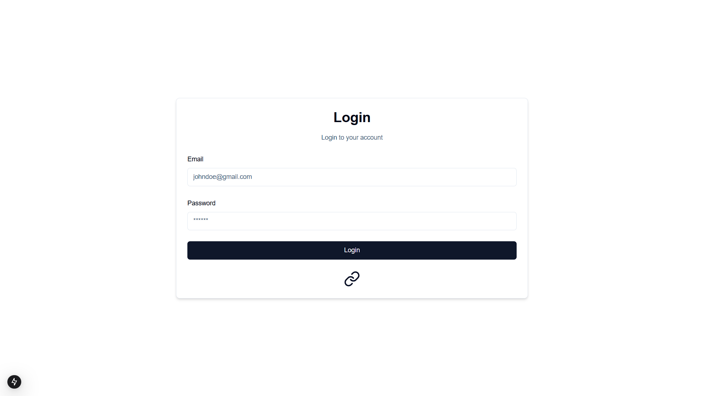
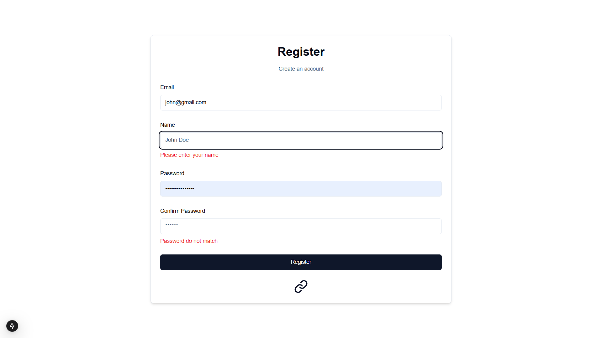

# Login and Register Form
#### Steps:
1. Run npm package install command
```bash
npm install --legacy-peer-deps
   ```
2. Run the development server:

```bash
npm run dev
```
For [Login](http://localhost:3000/auth/login) guide to /auth/login
</br>
For [Register](http://localhost:3000/auth/register) guide to /auth/register

You can start editing the page by modifying `app/page.tsx`. The page auto-updates as you edit the file.

This project uses [`next/font`](https://nextjs.org/docs/app/building-your-application/optimizing/fonts) to automatically optimize and load [Geist](https://vercel.com/font), a new font family for Vercel.

## Login Page

</br>

## Register Page


